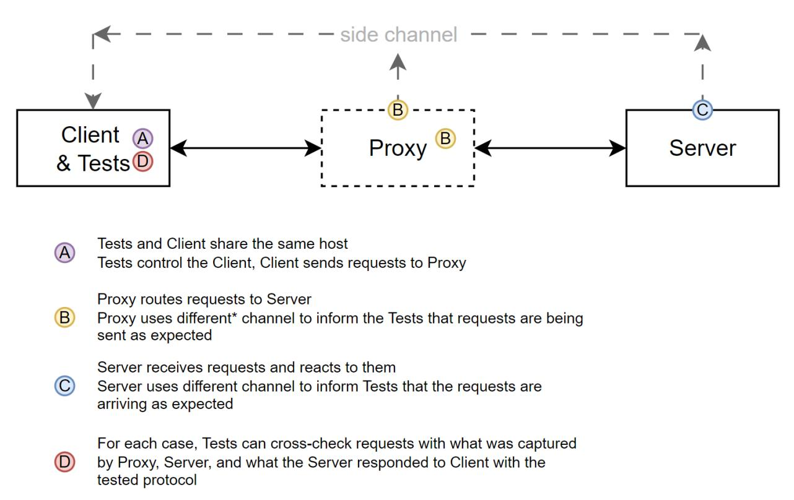

# HTTP protocol client/server test suite

This is a crude HTTP client/server accompanied by a test suite consisting of unit, integration and acceptance tests.

The main goal of all this is to try to explain how to test an HTTP protocol (RFC 9110) with both the client and the server.

## Test strategy

When considering how to test a protocol, I realized that it is not unlike testing a person on knowing a language. Much like a protocol, a language has rules and semantics.
While we cannot test a language, we can absolutely test someone on their knowledge (compliance) of a language. And I think this is the right approach here as well.

This codebase includes a very crude and mostly wrong implementation of an HTTP client and server. We can test their behavior on compliance to the HTTP protocol!

### Testing layers

#### Unit tests

These tests focus on examining each component of the system in isolation, where the opposing side (client or server) is replaced with mocks.

- Test client and server components in isolation
- Use mocks to emulate the other side of the communication
- Give quick feedback during development

#### Integration tests

Integration tests bring together the real client and server components, allowing them to make actual network calls but in a simplified environment.

- Connect __real__ client and server instances
- Run in simplified environments (localhost)
- Do actual network calls
- Verify protocol compliance
- Arguably best price to performance part of the test suite

#### Acceptance tests

The acceptance tests represent the most comprehensive and valuable, but expensive, part of the test suite. These tests should mimic a production environment.

- Deploy client and server in production-like environments (here it's containers, but could be VMs or bare metal)
- Test with real network conditions
- Performance testing
- Security testing
- Could include all middleware (proxies/load balancers, firewalls, DNS etc.)
- Comprehensive but slower to run
- Catch environment-specific issues
- Vendor specific (perhaps not always compliant with the protocol) behavior _(looking at you, Microsoft)_



__Note:__ It is important _not_ to verify the system using the same protocol we are testing. That way we can somewhat circumvent a scenario where our protocol is faulty/unreliable (aka [The Two Generals' Problem](https://en.wikipedia.org/wiki/Two_Generals%27_Problem)) and the tested system would "lie" to us about its own state. In the diagram above I propose to use probes at various points of the communication path, that would report back using a different protocol (observability).

### CI/CD and the Next steps

The next steps for this testing suite focus on the following:

- Container build pipeline, that would build new version of the client and server applications, and run them through the gauntlet of tests until finally, if they pass, making them ready for production deployment

- Adopting an infrastructure as code approach would allow for automated, __repeatable__ creation of test environments

- CI/CD system that would manage all this (including observability tools and logging)

- A unified source of truth for the protocol specification using an [Interface description language](https://en.wikipedia.org/wiki/Interface_description_language), bonus points for it being translatable to our code and tests

## Usage

Start the server
```bash
$ python server.py -p "hello right back"
```

Use the client to make a request
```bash
$ python client.py -r "request body"
```

You should see the request and the response in the stdout
```bash
[2025-02-23 16:43:49.459709]
Client_request:
HTTP/1.1 200 OK
User-Agent: CrappyClient/0.0.1
Content-Type: text/plain

request body

Client_response:
HTTP/1.1 200 OK
Server: CrappyServer/0.0.1
Content-Type: text/plain

hello right back
```

Display help

```bash
$ python client.py -h

$ python server.py -h
```

## Installation

Prerequisites: `Python 3.10+`

Clone this repository.

Bootstrap the virtual environment
```bash
$ python3 -m venv .venv
$ source .venv/bin/activate
```

Update `pip` and install `uv`
```bash
$ pip install --upgrade pip
$ pip install uv
```

Install the rest of the dependencies
```bash
$ uv sync
```

## Tests and linting

Run tests
```bash
$ pytest -v
```

Run linting
```bash
$ ruff check
$ mypy .
```
